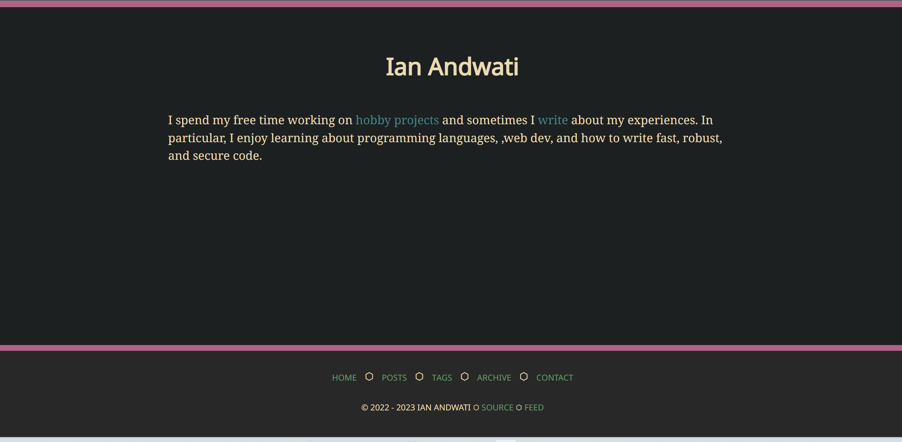
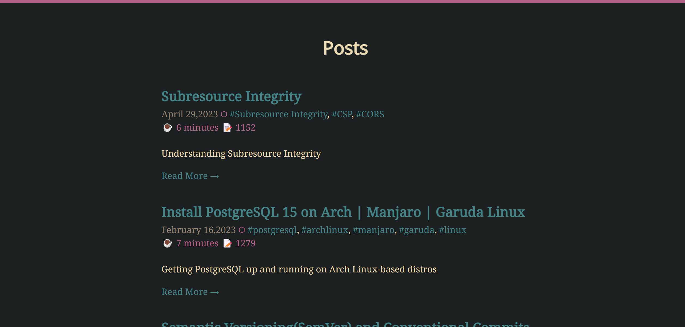
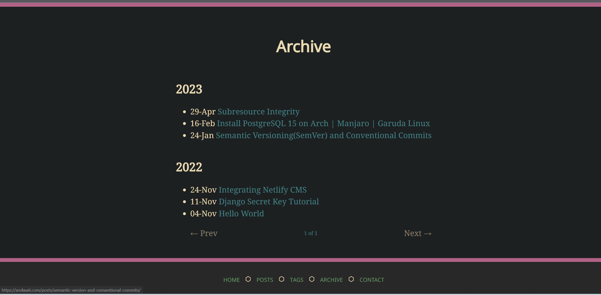
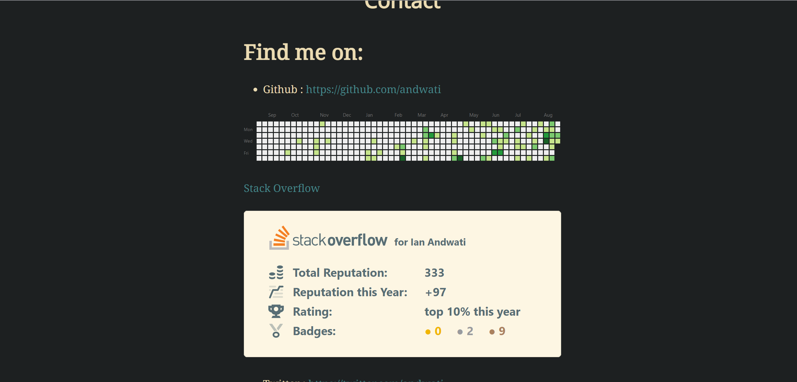

# https://andwati.github.io


MY personal page and blog site.

<p align="center" width="100%">
  
 
</p>

<p align="center" width="100%">
  
 
</p>

## Features

- [] Dark and light themes. Defaults to the OS setting, with a switcher in the navigation bar.
- [x] Support for comments using utterances
- [x] Perfect Lighthouse score (Performance, Accessibility, Best Practices and SEO).
- [] [KaTeX](https://katex.org/) support.
- [x] [feed](https://andwati.github.io/rss.xml).
- [x] [Archive page](https://andwati.github.io/archive/).
- [x] [Tags](<(https://andwati.github.io/tags/)>)
- [x] Responsive design.
- [x] Code syntax highlighting.
- [] Newsletter
- [x] Word Count and Reading time
- [x] Pagination

# Generating the site

## Steps

1. Clone this site and enter the directory.

```
repo='andwati.github.io'; git clone git@github.com:andwati/${repo}.git && cd $repo
```

2. Install or update to the latest Zola.

```
make update-zola
```

or install zola from [Github](https://github.com/getzola/zola)

3. Build the site!

```
make build
```

or

```
zola build
```

# Inspiration

This website was inspired by [gruvbox](https://github.com/morhetz/gruvbox),[Reilly Tucker Siemens](https://github.com/reillysiemens/tuckersiemens.com) and many more.

# License

This repo is licensed under [MIT License](./LICENSE)
